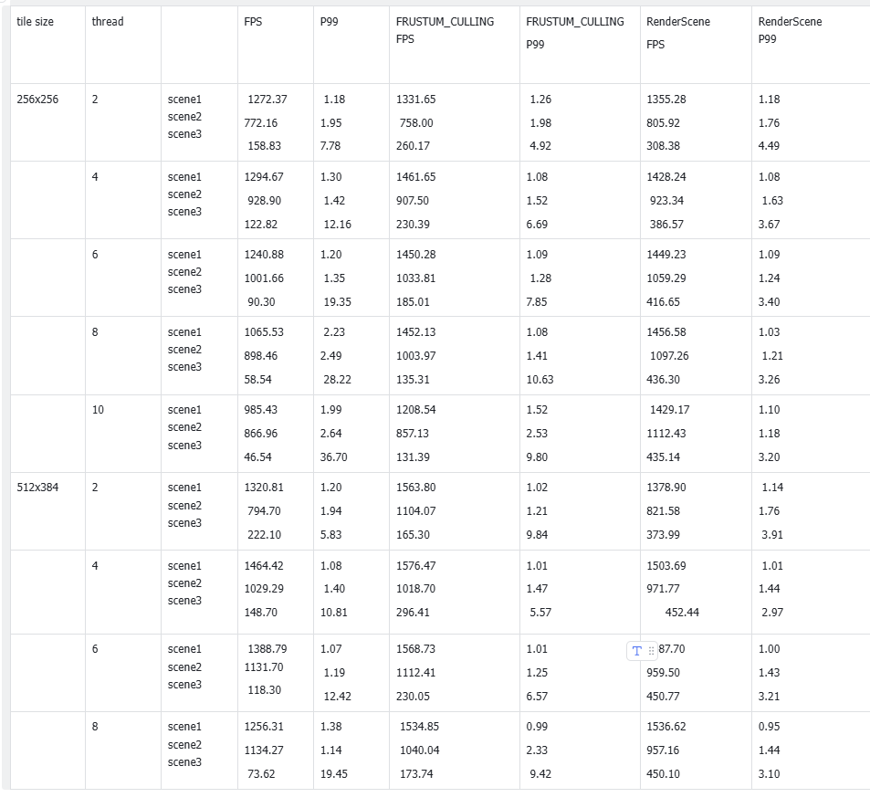

# CPU Software Rasterizer

A C++ CPU-rendering optimization project covering pipeline work reduction, AVX SIMD shading, and tile-based multithreading. The focus is measurable frame-time improvement and the tradeoff between parallelism and scheduling overhead.

## Features

The renderer extends the course framework with the following optimizations:

- **Pipeline optimizations:** transformed-vertex caching, light-vector pre-normalization, inverse-area reuse, early depth rejection, backface culling, and incremental edge-function rasterization.
- **SIMD processing:** structure-of-arrays data and AVX operations for batched transformations and eight-pixel shading.
- **Parallel rendering:** a custom thread pool and disjoint screen tiles, keeping color/depth writes within each task's region while sharing read-only inputs.
- **Workload reduction:** frustum rejection and preprocessing before tile dispatch.
- **Measurement:** warm-up, frame-time sampling, average FPS, P99 frame time, and comparisons across scenes, tile sizes, and worker counts.

## Recorded results

The report's Table 4 records the following **single-thread pipeline + SIMD** results. Ratios below are recalculated from its FPS values; they are not the table's inconsistent printed speedup column and do not include an additional multithreading speedup.

| Scene | Baseline FPS | Pipeline + SIMD FPS | FPS ratio | Baseline P99 (ms) | Optimized P99 (ms) |
| --- | ---: | ---: | ---: | ---: | ---: |
| 1 | 267.20 | 1061.76 | 3.97x | 6.17 | 1.57 |
| 2 | 120.32 | 550.48 | 4.58x | 10.37 | 2.54 |
| 3 | 79.22 | 234.61 | 2.96x | 14.76 | 5.53 |

These correspond to approximately **63–76% lower P99 frame time**. They are historical measurements from the development setup, not hardware-independent guarantees. Reproduce a comparison with the same scene, resolution, compiler configuration, and measurement settings, and record the CPU and power mode.

*Original multithreading measurements from the report. More workers do not consistently improve throughput; tile size and workload distribution matter. This is a separate experiment from the single-thread table above.*

## Build and run

1. Use Windows with the MSVC v143 toolset and Windows SDK. The Release x64 configuration enables AVX2; use a compatible CPU.
2. Open `Rasterizer.sln`, select **Release | x64**, and build/run `Rasterizer`.
3. The current `main()` in [`raster.cpp`](Rasterizer/raster.cpp) directly runs `scene3()`. To run another scene, change that call to `scene1()` or `scene2()` and rebuild. The commented selection code means changing `SCENE_SELECT` alone does not currently switch the entry point.
4. Change optimization switches and tile/worker settings in [`Macros.h`](Rasterizer/Macros.h), then rebuild for each comparison.
5. Read the console performance report after sampling completes. Escape exits the rendering loop.

Current measurement constants are `TARGET_TOTAL_LOOPS = 13000` and `WARMUP_LOOPS = 3000`. For a baseline, disable the relevant optimization switches; for a pipeline/SIMD comparison, keep multithreading disabled in both runs. Keep scene and output resolution fixed.

## Code guide

| File | Responsibility |
| --- | --- |
| [`raster.cpp`](Rasterizer/raster.cpp) | Scenes, render loops, and tile-job dispatch |
| [`triangle.h`](Rasterizer/triangle.h) | Triangle rasterization |
| [`AVX_SOA.h`](Rasterizer/AVX_SOA.h) | SIMD-friendly data and vector operations |
| [`ThreadPool.h`](Rasterizer/ThreadPool.h) | Worker scheduling |
| [`Profiler.h`](Rasterizer/Profiler.h) | Frame-time collection and reports |
| [`Macros.h`](Rasterizer/Macros.h) | Compile-time experiment settings |

## Background

Games Engineering coursework using the supplied GamesEngineeringBase framework. The [combined coursework report](WM9M4.pdf), Section 1, documents the optimization experiments; Section 2 covers a separate chat application. The image above is an original report figure.
